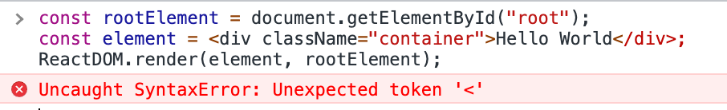

<!-- _class: lead -->
<!-- _backgroundColor: #222 -->

# [React.js](https://reactjs.org/)


---

## What is SPA?

* Application is not relaoded with new data on every user interaction


---

## Why do we need frameworks in JS?

* Common solutions for common problems
* HTML, CSS and JS stagnated and didn't improve for a while
* Official attempts to simplify development failed
* Proven solutions to deliver cutting edge experience
* ...


---

## Why do we need frameworks in JS?

* DX
* UX


---

## Why do we need React.js?

* DX
* UX


---

## Why do we need React.js?

* DX → Ease of keeping data and UI in sync
* DX → Ease of abstracting and reusing bits of logic as components
* UX → Under the hood optimizations for rendering and interactions


---

# Render something simple to page
https://codesandbox.io/s/plain-html-with-js-o7m2l


---

# Render simplest - vanilla

```js
const rootElement = document.getElementById("root");
const element = document.createElement("div");
element.textContent = "Hello World";
element.className = "container";
rootElement.appendChild(element);

```


---

## Render simplest - React `createElement`

```js
const rootElement = document.getElementById('root');

const element = React.createElement('div', {
    children: 'Hello World',
    className: 'container',
});

ReactDOM.render(element, rootElement)
```


---

## Render simplest - React JSX

```jsx
const rootElement = document.getElementById('root');
const message = "Hello World"
const element = <div className="container">{message}</div>

ReactDOM.render(element, rootElement);
```


---

## JSX is not a valid JS




---

## JS Transpilation

https://babeljs.io/repl


<!--
show that JSX transpiles to createElement under the hood
-->


---

## Render from array - vanilla

```js
const items = ['🍎', '🍏', '🍐', '🍑', '🍒', '🍓'];
const ul = document.createElement('ul');

document.getElementById('root').appendChild(ul);

items.forEach(function (item) {
  let li = document.createElement('li');
  ul.appendChild(li);

  li.innerHTML += item;
});
```


---
## Imperative vs Declarative

* ##### Imperative
  * explicit instructions to reach the outcome
  * the system is dumb, you are smart
* ##### Declarative
  * describe the outcome, let the system figure it out
  * the system is smart, you don't care


---
## Render from array - JSX

```jsx
const items = ['🍎', '🍏', '🍐', '🍑', '🍒', '🍓'];

const element = items.map(item => {
    return <li>{item}</li>;
});

const rootElement = document.getElementById('root');
ReactDOM.render(element, rootElement);
```


---

## Render often

<video autoplay loop muted playsinline>
  <source src="https://cdn.dribbble.com/users/173184/videos/17579/watxhli.mp4" />
</video>


---

## Render often happens often
https://codesandbox.io/s/plain-html-with-js-forked-vzgsy


---

## Render often happens often
https://codesandbox.io/s/plain-html-with-js-forked-vzgsy

```js
function tick() {
  const rootElement = document.getElementById("root");
  const time = new Date().toLocaleTimeString();
  const element = `
        <div>
            <span>Time:</span>
            <input type="text" value="${time}" />
        </div>
        `;
  rootElement.innerHTML = element;
}

setInterval(tick, 1000);

```


---
## [Virtual DOM & Reconciliation](https://reactjs.org/docs/reconciliation.html)

<style scoped>
img {
  width: 800px;
  margin-top: 1rem;
  display: flex;
  margin: 0 auto;
}
</style>


---
## Summary

* frameworks are to simplify our life and improve UX in apps
* React.js improves DX
* React.js improves UX 
* JSX is great


---

## Resources

- [React.js beta docs](https://beta.reactjs.org/)
- [React.js old docs (has some focus on legacy class components)](https://reactjs.org/)
- https://react.new - Codesandbox
- [Beginner guide by Kent C. Dodds](https://egghead.io/courses/the-beginner-s-guide-to-react)