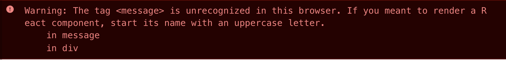

<!-- _class: lead -->
<!-- _backgroundColor: #222 -->

# [React.js](https://reactjs.org/)


---

### How do I nest components?

```jsx
const UserName = ({ name }) => return name.trim();

const UserProfile = ({ name, ... }) => {
  return (
    <div className="very-beautiful">
        // ?
    </div>
  )
}

const App = () => {
  return (
    <UserProfile>
      <UserName />
    </UserProfile>
  )
}

```


---

### What happens with lowercased components?

```js
const message = () => "hello";
const element = (
  <div>
    <message />
  </div>
);
```


---

### What happens with lowercased components?

```js
const message = () => "hello";
const element = /*#__PURE__*/React.createElement(
  "div", 
  null, 
  /*#__PURE__*/React.createElement("message", null)
);
```


---

### What happens with lowercased components?




---

### What happens with lowercased components?

> React used to contain a whitelist of well-known element names like div etc, which it used to differentiate between DOM elements and React components.
> 
> But because maintaining that list isn't all that fun, and **because web components** makes it possible to create custom elements, they made it a rule that all React components must start with a upper case letter, or contain a dot.


---

### Recap

* JSX is a special "zone" with special rules
  * srestricted between `<tags>`
  * inserts JS parts via `{ }` interpolation
* React components look almost like regular functions
  * `const User = ({ name }) => return name.toUpperCase()`
  * `{users.map(User)}`
  * `{users.map(user => User(user))}`
  * `{users.map(user => <User name={user.name} />)}`


---
## CRA

<div style="display: flex">


<span style="margin-left: 10px">

https://github.com/facebook/create-react-app
</span>

</div>


> You don’t need to install or configure tools like *webpack* or *Babel*. They are preconfigured and hidden so that you can ***focus on the code***.


---

## Most basic and used hooks


<style scoped>
  ul li { font-size: 0.9rem; }
</style>
- `useState`- https://beta.reactjs.org/reference/usestate
- `useEffect`- https://reactjs.org/docs/hooks-overview.html#effect-hook


---

## Don't add excessive state

```jsx
const User = (props) => {
  const [name, setName] = useState(props.name);
  const [nameInCaps, setNameInCaps] = useState(name); // 🤮🤮🤮

  useEffect(() => {
    setNameInCaps(name.toUpperCase());
  }, [name]);

  // ...

  return nameInCaps;
}
```


---

## Use derived values for props and state

```jsx
const User = ({ name }) => {
  const nameInCaps = name.toUppercase();
  // ...
  return nameInCaps;
}
```

* https://kentcdodds.com/blog/dont-sync-state-derive-it

* derived helps with [single source of truth](https://en.wikipedia.org/wiki/Single_source_of_truth) - one of the most important design principles


---

## Storing and updating data in component

```jsx
function Greeting() {
  const [name, setName] = React.useState('')
  const handleChange = event => setName(event.target.value)
  return (
    <div>
      <form>
        <label htmlFor="name">Name: </label>
        <input onChange={handleChange} id="name" />
      </form>
      {name ? <strong>Hello {name}</strong> : 'Please type your name'}
    </div>
  )
}

ReactDOM.render(<Greeting />, document.getElementById('root'))
```


---

## Reaction on something

* do something when value changes
* do something every time component is rendered
* do something when component is rendered for the first time


---

## Reaction on value changes

```jsx
const [name, setName] = React.useState(() => window.localStorage.getItem('name') || '')

React.useEffect(() => {
  window.localStorage.setItem('name', name)
}, [name])

const handleChange = event => setName(event.target.value)
```


---

# Less used hooks

<style scoped>ul li { font-size: 0.8rem; }</style>
* `useContext`- to create accessible points of data on different levels of comp nesting
* `useRef`
  * to work with dom elements
  * to store/update mutable values without causing render
  * in pair with `useImperativeHandle` enables *parent* to call *child* methods


---

## Even less used hooks


* `useReducer`- like *useState* but for complex changes
* `useCallback`, `useMemo`- to optimize stuff
* `useLayoutEffect`- similar to *useEffect*, mainly to read layout, calculate dimensions
* `useDebugValue`- label in React Devtools, for shared libraries


---

## React re-renders

<video autoplay loop muted playsinline>
  <source src="https://alexsidorenko.com/5026a216db461be8e241d5a23148ba0a/state-new.mp4" />
</video>


---

# React re-render ≠ DOM re-render

<style scoped>
img {
  width: 800px;
  margin-top: 1rem;
  display: flex;
  margin: 0 auto;
}
</style>


---

## Resources

<style scoped>ul li { font-size: 0.8rem; }</style>
- https://github.com/facebook/create-react-app - boilerplate start up
- https://alexsidorenko.com/blog/react-render-always-rerenders
- https://kentcdodds.com/blog/dont-sync-state-derive-it
- https://www.frontendmentor.io
  - [accordion](https://www.frontendmentor.io/challenges/faq-accordion-card-XlyjD0Oam), [countdown](https://www.frontendmentor.io/challenges/launch-countdown-timer-N0XkGfyz-), [todo app](https://www.frontendmentor.io/challenges/todo-app-Su1_KokOW), [sign-up form](https://www.frontendmentor.io/challenges/intro-component-with-signup-form-5cf91bd49edda32581d28fd1), [nested comments](https://www.frontendmentor.io/challenges/interactive-comments-section-iG1RugEG9)
- https://devhints.io/react - cheatsheet, class based but has hooks