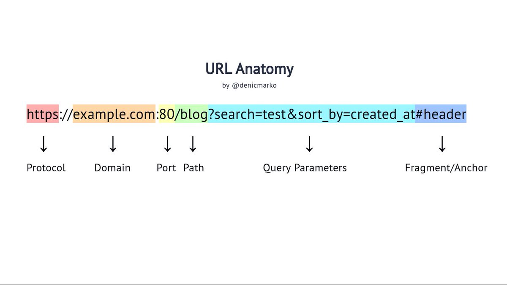
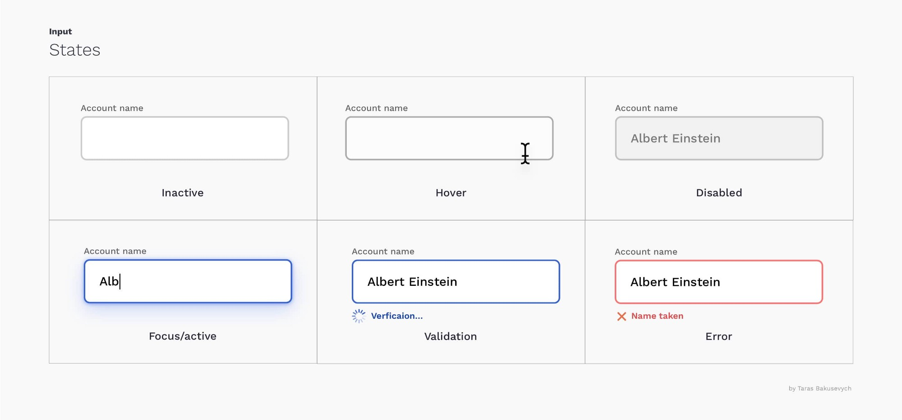
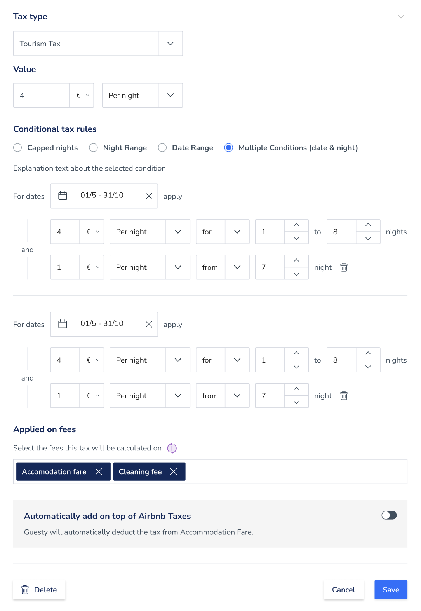
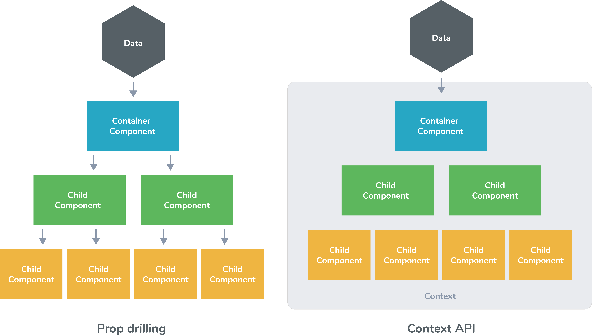

<!-- _class: lead -->
<!-- _backgroundColor: #222 -->

# [React.js](https://reactjs.org/)


---

<!-- _class: centered -->


---

## Types of state

* URL state
* Server state
* Form state
* Local state
* App state


---

## URL anatomy

<!-- _class: img-centered -->



---

## URL state

<!-- _class: img-centered -->


---

## URL state

Tools that simplify work with URLs are often referred as "routers"

- https://reactrouter.com
- https://react-location.tanstack.com


---

## URL state

```jsx
 <BrowserRouter>
    <Routes>
      <Route path="/" element={<App />}>
        <Route index element={<Home />} />
        <Route path="teams" element={<Teams />}>
          <Route path=":teamId" element={<Team />} />
          <Route path="new" element={<NewTeamForm />} />
```


---

## URL state

```jsx
  <Route path="users/:userID" element={<UserProfile />} />
```

```jsx
import { useParams } from 'react-router-dom';

function ProfilePage() {
  // Get the userID param from the URL.
  let { userID } = useParams();
  // ...
}
```


---

## URL state

```jsx
import { useSearchParams, useNavigate } from "react-router-dom";

function App() {
  let [searchParams, setSearchParams] = useSearchParams();
  let navigate = useNavigate(); // --> navigate("/posts")
  ...
```


---

## Form state

<!-- _class: img-centered -->



---

### Form state

<!-- _class: img-centered -->



---

## Form state

Keeps track of useful metadata for fields and form such as
`isDirty`, `dirtyFields`, `touchedFields`, `isSubmitted`, `isSubmitSuccessful`, `isSubmitting`, `isValid`, `errors`, ...


---

## Form state

- https://final-form.org/react
- https://formik.org
- https://react-hook-form.com


---

## Server state

Keeps track of useful metadata describing communication with BE resource:
`isLoading`, `error`, ...

Also can include caching, normalization, optimistic updates and other advanced techniques


---

### Server state

```jsx
const { status, data, error, isFetching } = usePosts();
```


---

### Server state

```jsx

const getPosts = async () => {
  const { data } = await axios.get(
    "https://jsonplaceholder.typicode.com/posts"
  );
  return data;
};

export default function usePosts() {
  return useQuery("posts", getPosts);
}
```


---

## Server state

- https://react-query.tanstack.com
- https://redux-toolkit.js.org/rtk-query/overview
- https://swr.vercel.app


---

## App state

Some data in time that affects the whole application


---

## App state

- https://reactjs.org/docs/hooks-reference.html#usecontext
- https://redux-toolkit.js.org
- https://jotai.org/
- *... dozens of ther libs*


---

## App state

<!-- _class: img-centered -->



---

## Resources

<style scoped>ul li { font-size: 0.8rem; }</style>
- https://stateofjs.com
- https://javascriptweekly.com
- https://react.statuscode.com
- [https://bytes.dev](https://bytes.dev/?x=1197221723&ck_subscriber_id=1197221723)