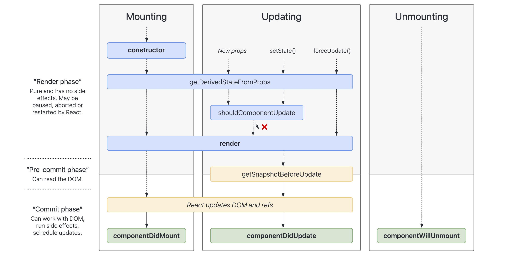
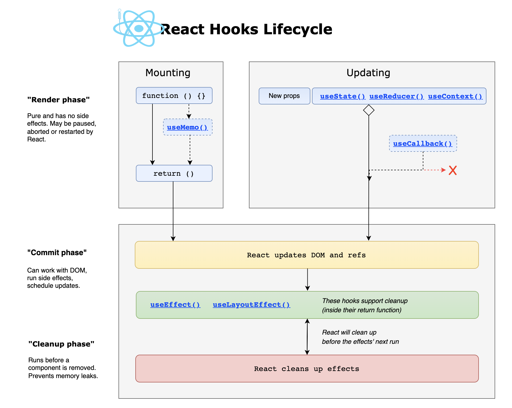

<!-- _class: lead -->
<!-- _backgroundColor: #222 -->

# [React.js](https://reactjs.org/)


---

### Functional components

```jsx
function Welcome(props) {
  return <h1>Hello, {this.props.name}</h1>;
}
```


---

### Class components


```jsx
class Welcome extends React.Component {
  render() {
    return <h1>Hello, {this.props.name}</h1>;
  }
}
```


---

### Class components

> The only method you must define in a React.Component subclass is called `render()`. All the other methods are optional.


---

### Class components

```jsx
class Header extends React.Component {
  constructor(props) {
    super(props);
    // this.state = {favoritecolor: "red"};
  }
  static getDerivedStateFromProps(props, state) {
    // return {favoritecolor: props.favcol };
  }
  componentDidMount() {
    // this.setState({favoritecolor: "yellow"})
  }
  shouldComponentUpdate(nextProps, nextState) {
    // return nextState.favoritecolor !== this.state.favoritecolor;
  }
  getSnapshotBeforeUpdate(prevProps, prevState) {
    //
  }
  componentDidUpdate(prevProps, prevState, snapshot) {
    // if (this.props.userID !== prevProps.userID) {
    //   this.fetchData(this.props.userID);
    // }
  }
  componentWillUnmount() {
    // alert("The component named Header is about to be unmounted.");
  }
  render() {
    return (
      <h1>My Favorite Color is {this.state.favoritecolor}</h1>
    );
  }
}
```


---


### Component lifecycle

Mount phase:
- `constructor()`
- `static getDerivedStateFromProps()`
- `render()`
- `componentDidMount()`


---

### Component lifecycle

Update phase:
- `static getDerivedStateFromProps()`
- `shouldComponentUpdate()`
- `render()`
- `getSnapshotBeforeUpdate()`
- `componentDidUpdate()`


---

### Component lifecycle

Unmount phase:
- `componentWillUnmount()`


---

### Component lifecycle

Error handling
- `static getDerivedStateFromError()`
- `componentDidCatch()`


---

### Component lifecycle

<!-- _class: img-centered -->



---

### [Component lifecycle](https://stackblitz.com/github/Oblosys/react-lifecycle-visualizer/tree/master/examples/parent-child-demo?file=src%2FApp.js)

<!-- _class: img-centered -->


---

### Functional lifecycle

<!-- _class: img-centered -->



---

## Resources

<style scoped>ul li { font-size: 0.8rem; }</style>
- https://reactjs.org/docs/react-component.html#the-component-lifecycle
- https://projects.wojtekmaj.pl/react-lifecycle-methods-diagram/
- https://wavez.github.io/react-hooks-lifecycle/