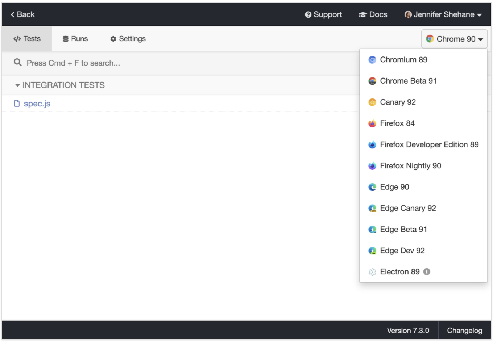
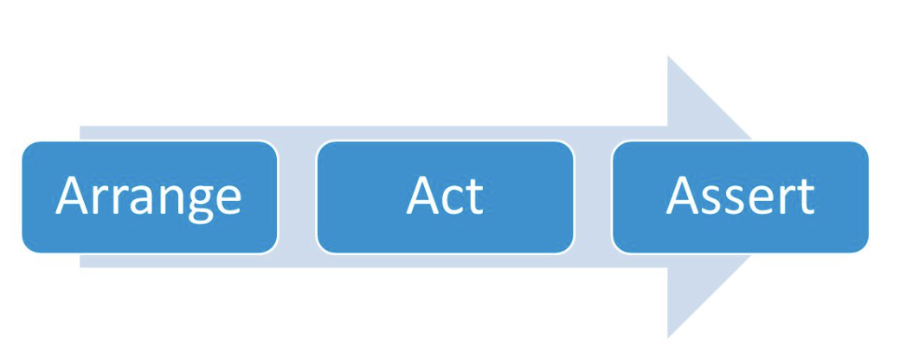
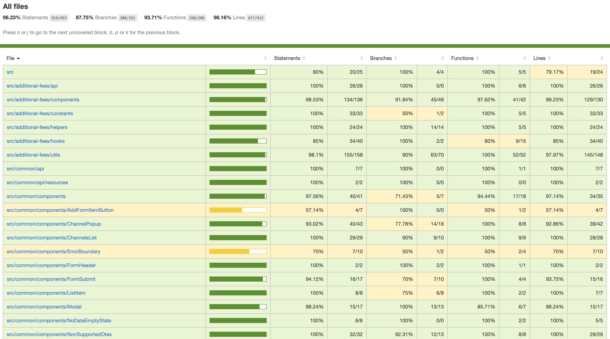
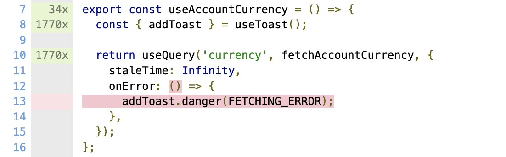

<!-- _class: lead -->
<!-- _backgroundColor: #222 -->

# [React.js](https://reactjs.org/)


---

### Types of testing

* **static checks** - via TypeScript, linters, jsdoc, etc
* **unit tests** - ensure smallest parts of application work as intended
* **integration tests** - widgets, forms, etc work correctly
* **e2e tests** - check app as if a user, from auth till checkout


---

### Types of testing

it is a blurry line between types of tests, 
often you will not be able to distinguish integration vs e2e test


---

### Mocking

* Unit tests
  * everything except for this particular function or class is mocked
  * in practice, it is too tedious to mock everything
* Integration tests
  * input data is mocked
* E2E
  * ideally, nothing is mocked
  * in practice it is more convenient to mock some things *(e.g. Feature Toggles, language, timezone, third-party providers)*


---

### Types of testing

<!-- _class: smaller-list -->
* **static checks** - saves time as you write code
* **unit tests** - helps to design your code, prevents regressions as you refactor
* **integration tests** - ensures widgets and pages work as expected together
* **e2e tests** - ensures app works as expected


---

<!-- _class: centered -->

>  I want to be confident that the code I'm writing for the future won't break the app that I have running in production today
> &mdash; [Kent C Dodds](https://kentcdodds.com/blog/static-vs-unit-vs-integration-vs-e2e-tests)


---

### E2E tests

A helper robot that behaves like a user to click around the app and verify that it functions correctly.


---

<!-- _class: centered -->


---

### Cypress.io

<!-- _class: more-space -->

* Automatic waiting
* Automatic retries
* Network traffic control
* Screenshots and videos
* Spies, stubs and clocks
* Debuggability
* Time travel
* Parallelization
* Component Testing
* Superb documentation!


---

### Cypress.io

<!-- _class: more-space -->

```properties
npm install cypress --save-dev
```

```properties
npx cypress open
```




---

### Cypress.io

```js
describe('My First Test', () => {
  it('clicking "type" navigates to a new url', () => {
    cy.visit('https://example.cypress.io');

    cy.contains('type').click();

    // Should be on a new URL which includes '/commands/actions'
    cy.url().should('include', '/commands/actions');
  });
});
```

---

### AAA

<!-- _class: img-centered -->



---

###


- **Arrange** - prepare UI you want to test
- **Act** - interact with your UI
- **Assert** - check that UI correctly behaves after actions


---

### AAA


* Load login page <- **Arrange**
* Type 'umbrella' to "password" input <- **Act**
* Check that user sees a "Weak password" message <- **Assert**


---

### AAA

```js
describe('Authorization', () => {

    it('should encourage more protected passwords', () => {
        cy.visit('/login'); // <- Arrange

        cy.get('[name="password"]').type('umbrella'); // <- Act

        cy.contains('Weak password'); // <- Assert
    });
});
```

---

<!-- _class: centered -->
# [READ DOCUMENTATION!!!1!](https://docs.cypress.io/guides/overview/why-cypress)


---

### Most used commands

<!-- _class: more-space -->

[https://docs.cypress.io/api/commands](https://docs.cypress.io/api/commands/and)

* [`cy.visit('http://localhost:3000')`](https://docs.cypress.io/api/commands/visit)
* [`cy.get('.list > li')`](https://docs.cypress.io/api/commands/get)
* [`cy.get('.article').find('footer')`](https://docs.cypress.io/api/commands/find)
* [`cy.contains('Hello')`](https://docs.cypress.io/api/commands/contains#Syntax)
* [`cy.get('.menu-item').trigger('mouseover')`](https://docs.cypress.io/api/commands/hover#Trigger) // aka "hover"
* [`cy.intercept('POST', '/register', { statusCode: 200 })`](https://docs.cypress.io/api/commands/intercept#Usage)
* [`cy.get(':checkbox').should('be.disabled')`](https://docs.cypress.io/api/commands/should) // very powerful!
* [`cy.get('.list').within(() => {})`](https://docs.cypress.io/api/commands/within) // drill down to element's scope


---

<!-- _class: centered -->

<blockquote class="twitter-tweet"><p lang="en" dir="ltr">Write tests. Not too many. Mostly integration.</p>&mdash; Guillermo Rauch (@rauchg) <a href="https://twitter.com/rauchg/status/807626710350839808?ref_src=twsrc%5Etfw">December 10, 2016</a></blockquote> <script async src="https://platform.twitter.com/widgets.js" charset="utf-8"></script>


---

### Not too many?

[Rule of diminishing returns](https://www.britannica.com/topic/diminishing-returns)

- the first test gives confidence your app does not crash
- first couple of test scenarios will make sure happy flows work
- all the edge cases are hard to come up with and cover in advance


---

### Code coverage

<!-- _class: more-space -->




---

### Code coverage

is just a starting point and a helper tool, **not a goal**


---

### Not too many?

```
=============================== Coverage summary ===============================
Statements   : 96.23% ( 919/955 )
Branches     : 87.75% ( 308/351 )
Functions    : 93.71% ( 268/286 )
Lines        : 96.16% ( 877/912 )
================================================================================
```


---

### Not too many?



<small>A highly **unlikely** error, writing test for it isn't hard, but just **not necessary**</small>


---

### Notes


<!-- _class: smaller-list more-space -->
* Flaky tests are OK
* Believe in your e2e
* You should very rarely have to change tests when you refactor code
* Avoid testing implementation details, focus on results
* Almost never use `cy.wait(1000)`
* Do not rely on style classes, use dedicated selectors `cy.get([data-qa="submit-button"])`
* Avoid writing custom cy.commands
* Avoid “reusing” parts of tests via abstractions, unless those are true abstractions
* Copy paste is ok, tests should be as simple as possible
* Don’t `skip` tests, fix them or remove them
* "thenables" are not Promises `cy.get(button).then(() => {})`


---

## Resources

<!-- _class: smaller-list -->
- https://www.youtube.com/watch?v=S4hcRcJLIGo&t=497s&ab_channel=JSHeroes
- https://www.cypress.io
- https://glebbahmutov.com/blog/open-source-visual-testing-of-components
- https://www.youtube.com/glebbahmutov
- https://kentcdodds.com/blog/write-tests
- https://kentcdodds.com/blog/static-vs-unit-vs-integration-vs-e2e-tests