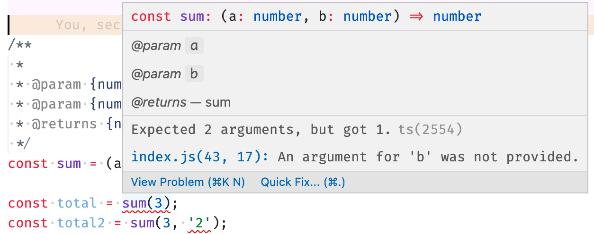

<!-- _class: lead -->
<!-- _backgroundColor: #222 -->

# [React.js](https://reactjs.org/)


---

  ### Types of testing

* **static checks** - via TypeScript, linters, jsdoc, etc
* **unit tests** - ensure smallest parts of application work as intended
* **integration tests** - widgets, forms, etc work correctly
* **e2e tests** - check app as if a user, from auth till checkout


---

### Static checks

* always use linters
* try to benefit from typings even if you don't use TypeScript


---

### Static checks
[in VSCode](https://code.visualstudio.com/docs/nodejs/working-with-javascript#_type-checking-javascript):
```js
// jsconfig.json
{
  "compilerOptions": {
    "checkJs": true
  },
  "exclude": ["node_modules", "**/node_modules/*"]
}
```


---

### Static checks

```js
const sum = (a,b) => a + b;

const total = sum(3)
```


---

### Static checks

```js
/**
 * 
 * @param {number} a 
 * @param {number} b 
 * @returns {number} sum
 */
const sum = (a,b) => a + b;

const total = sum(3)
```


---

### Static checks




---

### Unit tests


> UNIT TESTING is a type of software testing where individual units or components of a software are tested.


---

### Unit tests


<!-- _class: more-space img-centered -->


---

### Unit tests

> Unit tests are NOT meant to ensure application works as expected and catch all the bugs


---

### Unit tests

* acts as a documentation
* helps you to design better
* gives confidence to change code at a later date


---

### Unit tests

```js
const buildURL = ({ version, domain, isPublic, config }) => {
  const { API_GATEWAY, API_GATEWAY_PUBLIC, PROXY_URL, MAILER_URL } = config;

  if (version === 'v3') {
    const gateway = isPublic ? API_GATEWAY_PUBLIC : API_GATEWAY;

    if (domain[0] === '/') {
      return `${gateway}${domain}`;
    }

    return `${gateway}/${domain}`;
  }

  if (version === 'proxy') {
    return PROXY_URL;
  }

  return MAILER_URL;
};
```


---

### Unit tests

```js
const { api } = Resource.create(''); // ?
const { api } = Resource.create({ domain: '' }); // ?
const { api } = Resource.create('/'); // ?
const { api } = Resource.create({ domain: '/' }); // ?
const { api } = Resource.create('statements'); // ?
const { api } = Resource.create('/statements'); // ?
const { api } = Resource.create({ domain: '/statements' }); // ?
```


---

### Unit tests

<!-- _class: more-space -->

```js
test('should point to api with trailing slash if leading slash passed', () => {
    const { api } = Resource.create('/');
    const expected = 'https://app-staging.comp.com/api/';
    expect(api.defaults.baseURL).toEqual(expected);
});
test('should point to api when domain with slashed provided', () => {
    const { api } = Resource.create({ domain: '/' });
    const expected = 'https://app-staging.comp.com/api/';
    expect(api.defaults.baseURL).toEqual(expected);
});
test('should point to api with trailing slash if empty string provided', () => {
    const { api } = Resource.create('');
    const expected = 'https://app-staging.comp.com/api/';
    expect(api.defaults.baseURL).toEqual(expected);
});
test('should point to mailer when empty domain provided', () => {
    const { api } = Resource.create({ domain: '' });
    const expected = 'https://app-staging.comp.com/api/v2';
    expect(api.defaults.baseURL).toEqual(expected);
});
```


---

### Unit tests


* You will have more code in unit test than in function itself
* Do not do any logic inside of your tests, be as simple and straightforward as possible
  * otherwise, who will **test** the **test**?
* Embrace TDD, especially for complex bits of applications


---

### Test Driven Development

<!-- _class: more-space img-centered -->


---

### [Jest](https://jestjs.io/)

> Jest is a delightful JavaScript Testing Framework with a focus on simplicity.


<small>⚠️ *In practice: not so simple at all, especially when you need to mock modules*</small>


---

### [Enzyme](https://enzymejs.github.io/enzyme)

> Enzyme is a JavaScript Testing utility for React that makes it easier to test your React Components' output. You can also manipulate, traverse, and in some ways simulate runtime given the output.


---

### Component Unit tests

<!-- _class: more-space -->

```js
import React from 'react';
import {shallow} from 'enzyme';
import CheckboxWithLabel from '../CheckboxWithLabel';

test('CheckboxWithLabel changes the text after click', () => {
  // Render a checkbox with label in the document
  const checkbox = shallow(<CheckboxWithLabel labelOn="On" labelOff="Off" />);

  expect(checkbox.text()).toEqual('Off');

  checkbox.find('input').simulate('change');

  expect(checkbox.text()).toEqual('On');
});
```
<small>⚠️ *In practice: "shallow" is not good enough*</small>


---

## Resources

<style scoped>ul li { font-size: 0.8rem; }</style>
- https://egghead.io/courses/testing-javascript-with-jest-a36c4074 - a bit outdated, mainly to get concepts
- https://egghead.io/lessons/redux-adding-tests-for-a-redux-reducer - has practical commands to follow
- https://medium.com/javascript-scene/why-i-use-tape-instead-of-mocha-so-should-you-6aa105d8eaf4
- https://code.visualstudio.com/docs/nodejs/working-with-javascript#_type-checking-javascript
- https://jsdoc.app - documentation itself looks archaic
- https://enzymejs.github.io/enzyme
- https://jestjs.io/docs/tutorial-react